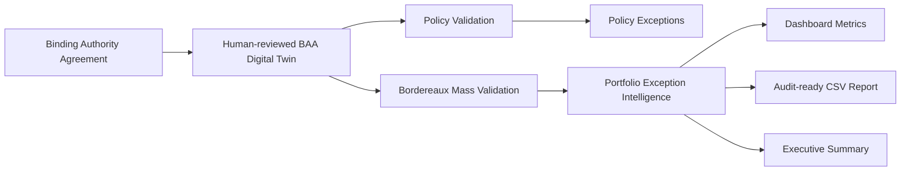
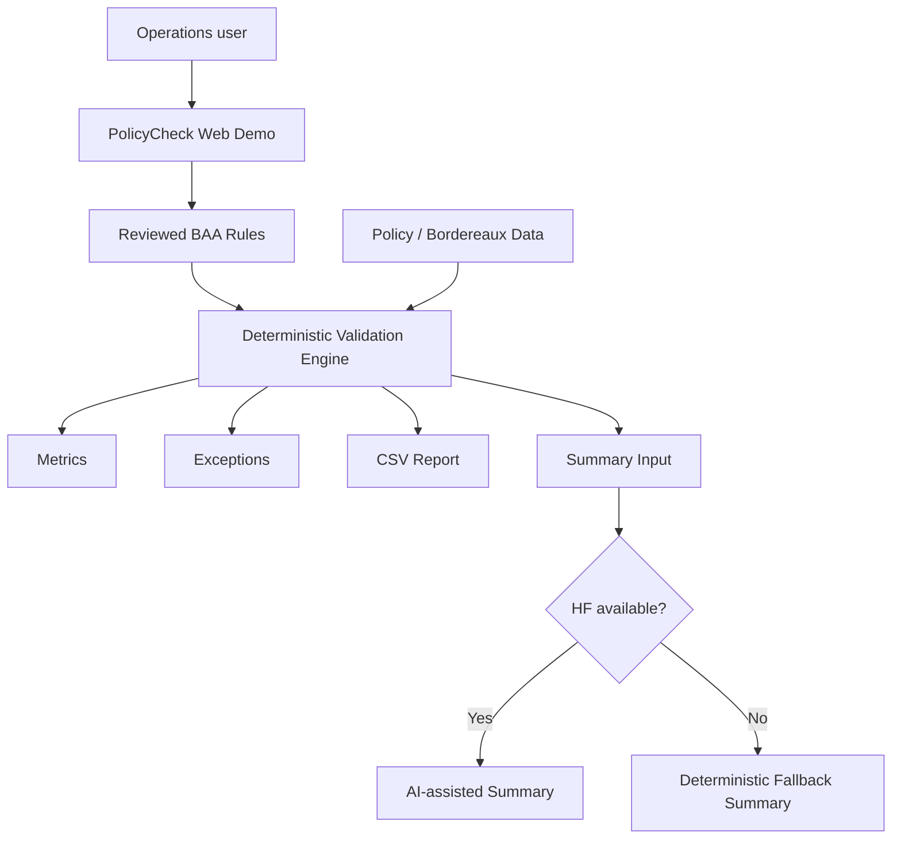
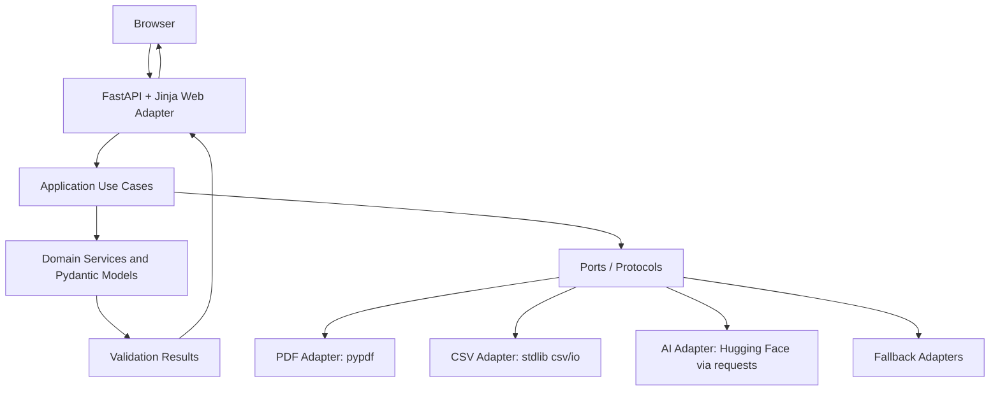
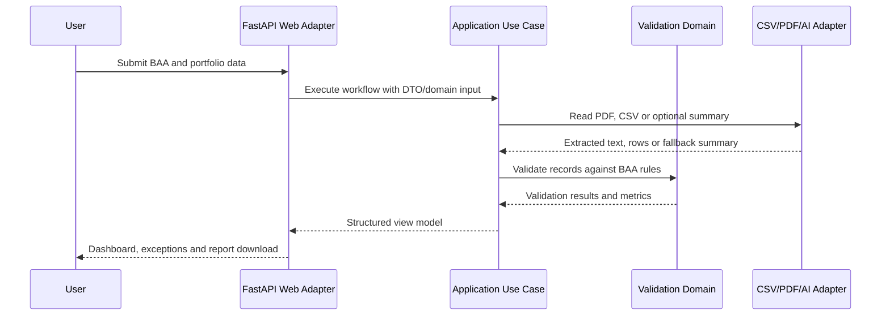
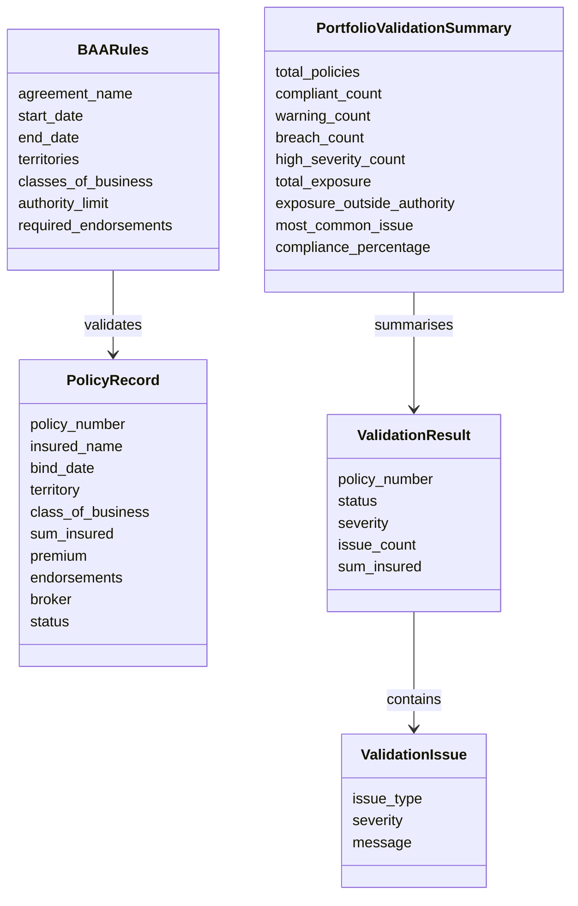
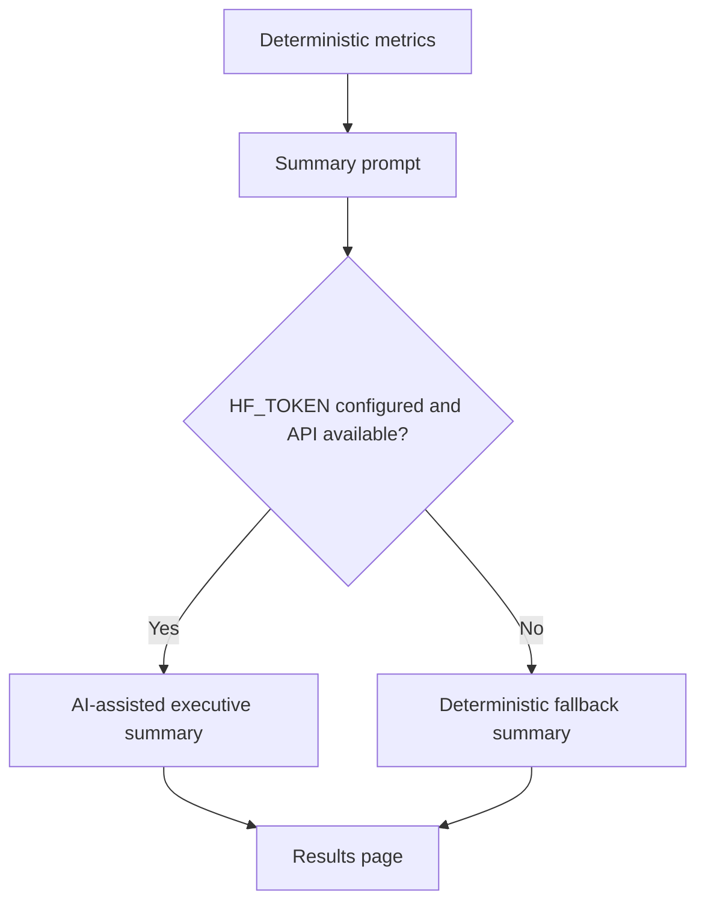
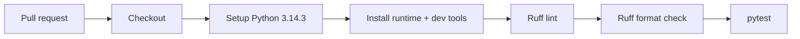

# PolicyCheck Demo

PolicyCheck is a lightweight product-grade demo for insurance operational intelligence. It turns a reviewed Binding Authority Agreement into an executable digital twin, then validates individual policies and bordereaux portfolios against the reviewed authority controls.

The demo is intentionally designed for a Render free-tier deployment: FastAPI, Jinja, static CSS, small file uploads, standard-library CSV processing and optional requests-based Hugging Face calls with deterministic fallbacks.

## Product narrative

Insurance operations teams often discover binder and bordereaux mistakes too late: after reporting, reconciliation, audit review or claims friction. PolicyCheck demonstrates a safer workflow:

1. Upload or define a Binding Authority Agreement.
2. Extract candidate rules from the document.
3. Keep a human review step before rules become executable.
4. Validate individual policies or a full bordereaux portfolio.
5. Surface breaches, warnings, exposure and audit-friendly explanations.
6. Download an exception report for operational follow-up.

## Current capabilities

- Manual BAA rule entry
- Text-based BAA PDF upload
- AI-assisted BAA rule extraction with human review
- Single policy validation
- Synthetic bordereaux generation
- Bordereaux CSV upload with tolerant column mapping
- Mass validation against reviewed BAA controls
- Validation dashboard and exception table
- Downloadable exception report CSV
- Optional AI-assisted executive summary with deterministic fallback
- Responsive and accessibility-oriented dark UI

## Business architecture

The business flow is deliberately simple. PolicyCheck does not replace underwriting judgement. It gives operations teams a structured way to catch document and authority exceptions earlier.



## Operating model



## Solution architecture

The application is a modular monolith. FastAPI and Jinja are inbound adapters. Domain rules are framework-independent. AI and PDF/CSV integrations are outbound adapters behind lightweight ports.



## Hexagonal architecture boundaries

```mermaid
flowchart LR
    subgraph Inbound[Inbound adapter]
        Web[FastAPI routes]
        Forms[Form parsers and view models]
        Templates[Jinja templates]
    end

    subgraph Application[Application layer]
        Extract[Extract BAA Rules]
        Single[Validate Single Policy]
        Synthetic[Generate Synthetic Bordereaux]
        Mass[Validate Bordereaux]
        Report[Generate Exception Report]
        Summary[Generate Portfolio Summary]
    end

    subgraph Domain[Domain layer]
        Models[Pydantic domain models]
        Rules[Deterministic validation services]
    end

    subgraph Ports[Ports]
        PdfPort[PdfTextExtractor]
        AiRulesPort[AiRuleExtractor]
        AiSummaryPort[AiSummaryGenerator]
        CsvPort[BordereauxReader]
        ReportPort[ReportWriter]
    end

    subgraph Outbound[Outbound adapters]
        PyPdf[pypdf text extraction]
        Hf[Hugging Face requests adapter]
        Local[Deterministic fallback adapters]
        Csv[CSV reader/writer]
    end

    Web --> Application
    Forms --> Application
    Application --> Domain
    Application --> Ports
    Ports --> Outbound
    Templates <-- Web
```

## Application flow



## Domain model overview



## Deterministic validation rules

AI never decides compliance. Compliance is owned by deterministic domain services.

Rules currently checked:

- Bind date must be inside the BAA start and end date.
- Territory must be one of the permitted territories.
- Class of business must be one of the permitted classes.
- Sum insured must not exceed the authority limit.
- Required endorsements must be present.
- Missing or malformed values produce warnings or breaches instead of stack traces.
- Multiple issues per policy are supported.

## AI usage policy

AI is used only for assistance:

- Extracting candidate BAA rules from text for human review.
- Generating a human-readable portfolio summary from deterministic metrics.

AI is not used to decide whether a policy is compliant. If Hugging Face is unavailable, slow, rate-limited or not configured, the app falls back to deterministic local logic.



## Repository structure

```text
policycheck_demo/
  app.py                         # FastAPI entrypoint and web adapter compatibility layer
  domain/                        # Pydantic models and deterministic domain services
  application/                   # Use cases and DTO contracts
  ports/                         # Protocol-based outbound interfaces
  adapters/                      # PDF, AI and CSV adapter implementations
  infrastructure/                # Config and lightweight composition root
  templates/                     # Jinja templates
  static/                        # CSS assets

tests/
  domain/
  application/
  adapters/
  web/
```

## Local development

```bash
python -m venv .venv
source .venv/bin/activate
python -m pip install --upgrade pip
pip install -r requirements.txt
uvicorn policycheck_demo.app:app --reload
```

Open `http://127.0.0.1:8000`.

## Quality checks

Development tools are intentionally installed outside production requirements.

```bash
pip install pytest ruff
ruff check .
ruff format --check policycheck_demo/domain policycheck_demo/application policycheck_demo/ports policycheck_demo/adapters policycheck_demo/infrastructure tests
pytest
```

## CI

GitHub Actions runs on pull requests and pushes to `main`.



## Render free-tier constraints

This demo is deliberately small and cheap to run.

- No database
- No authentication
- No queues
- No background workers
- No OCR
- No local ML model loading
- No pandas, torch, transformers, LangChain or LlamaIndex
- Standard-library CSV processing
- Optional network AI calls with fallback
- Small synthetic bordereaux datasets: 25, 50 or 100 rows
- Text-based PDF extraction only

## Deployment

The existing Render deployment remains supported. The app entrypoint is unchanged:

```bash
uvicorn policycheck_demo.app:app --host 0.0.0.0 --port $PORT
```

## Current limitations

- Scanned PDFs are not OCR'd.
- Excel upload is out of scope.
- There is no persistence between requests.
- There are no user accounts, tenant isolation or permissions.
- The demo focuses on product narrative and architecture shape, not full enterprise workflow management.

## Design principle

PolicyCheck is built around one core idea: AI can assist the operator, but deterministic rules and human-reviewed controls own compliance decisions.
