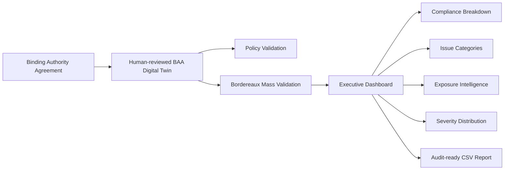
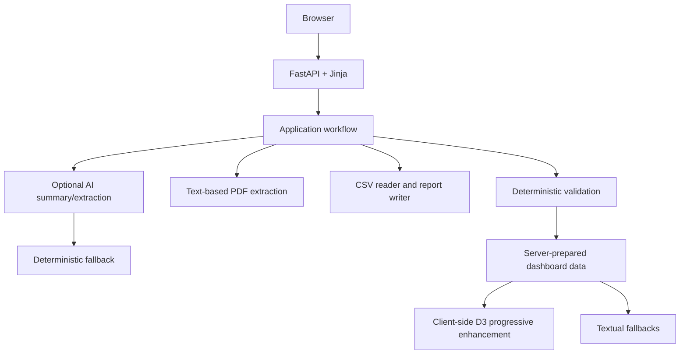
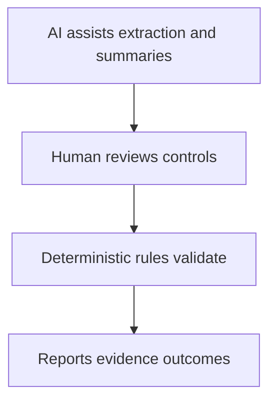

# PolicyCheck Demo

PolicyCheck is a lightweight product-grade demo for insurance operational intelligence. It turns a reviewed Binding Authority Agreement into an executable digital twin, then validates individual policies and bordereaux portfolios against reviewed authority controls.

The demo is intentionally designed for Render free tier: FastAPI, Jinja, static CSS, standard-library CSV processing, optional requests-based Hugging Face calls with deterministic fallback, and D3 loaded client-side only where useful.

## Current capabilities

- Manual BAA rule entry
- Text-based BAA PDF upload
- AI-assisted BAA rule extraction with human review
- Single policy validation
- Synthetic bordereaux generation
- Bordereaux CSV upload with tolerant column mapping
- Mass validation against reviewed BAA controls
- Executive validation dashboard
- Compliance, issue, exposure and severity visualisations
- Searchable and filterable exception table
- Downloadable exception report CSV
- Optional AI-assisted executive summary with deterministic fallback
- Interactive `/how-it-works` page explaining the trust model and architecture

## Product narrative

Insurance operations teams often discover binder and bordereaux mistakes too late: after reporting, reconciliation, audit review or claims friction. PolicyCheck demonstrates a safer workflow:

1. Upload or define a Binding Authority Agreement.
2. Extract candidate rules from the document.
3. Keep a human review step before rules become executable.
4. Validate individual policies or a full bordereaux portfolio.
5. Surface breaches, warnings, exposure, severity and issue patterns.
6. Download an exception report for operational follow-up.

## Business architecture



## Solution architecture



## Trust model



AI assists extraction and summarisation. It does not make final compliance decisions. The reviewed BAA controls are used by deterministic validation logic, making outcomes explainable and easier to audit.

## Interactive dashboard

The mass validation results page now includes:

- Compliance breakdown visualisation
- Issue category distribution
- Exposure reviewed vs outside authority
- Severity distribution
- Most common issue insight
- Portfolio risk summary
- Lightweight exception filters and search
- Textual fallbacks if JavaScript or D3 does not load

D3 is loaded from a pinned CDN only on the results page. There is no Node.js build step, frontend framework, server-side chart rendering or Python charting dependency.

## How it works page

`GET /how-it-works` provides a client-safe explanation of the demo:

- Interactive workflow timeline
- Conceptual architecture map
- Trust model cards
- Current demo scope vs production path
- Technical overview written for clients and stakeholders

It deliberately avoids secrets, prompts, implementation-sensitive detail and any claim of guaranteed legal compliance.

## Local development

```bash
python -m venv .venv
source .venv/bin/activate
python -m pip install --upgrade pip
pip install -r requirements.txt
uvicorn policycheck_demo.app:app --reload
```

Open `http://127.0.0.1:8000`.

## Quality checks

```bash
pip install pytest ruff
ruff check .
ruff format policycheck_demo/domain policycheck_demo/application policycheck_demo/ports policycheck_demo/adapters policycheck_demo/infrastructure tests
pytest
```

## Render free-tier constraints

- No database
- No authentication
- No queues
- No background workers
- No OCR
- No local ML model loading
- No pandas, torch, transformers, LangChain or LlamaIndex
- Standard-library CSV processing
- Optional network AI calls with fallback
- D3 is client-side only
- Small synthetic bordereaux datasets: 25, 50 or 100 rows
- Text-based PDF extraction only

## Deployment

The existing Render deployment remains supported. The app entrypoint is unchanged:

```bash
uvicorn policycheck_demo.app:app --host 0.0.0.0 --port $PORT
```

## Current limitations

- Scanned PDFs are not OCR'd.
- Excel upload is out of scope.
- There is no persistence between requests.
- There are no user accounts, tenant isolation or permissions.
- This is a POC, not a production compliance engine.

## Design principle

PolicyCheck is built around one core idea: AI can assist the operator, but deterministic rules and human-reviewed controls own compliance decisions.
